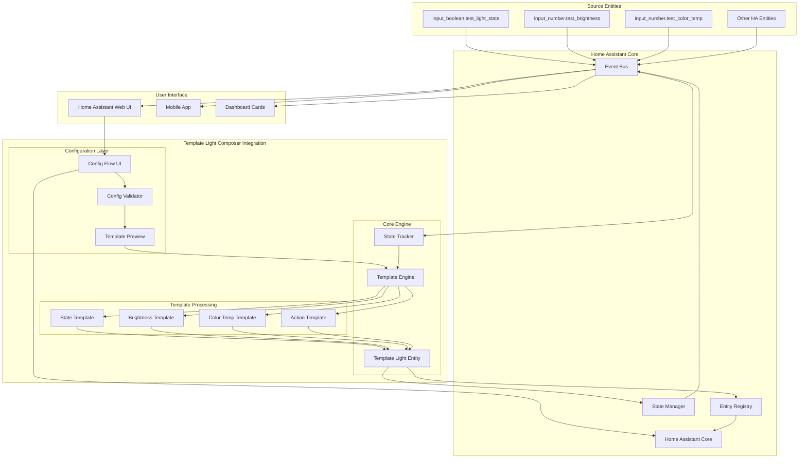
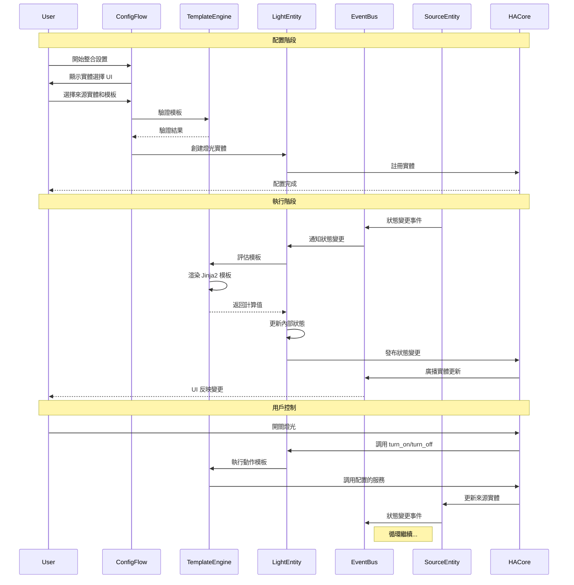
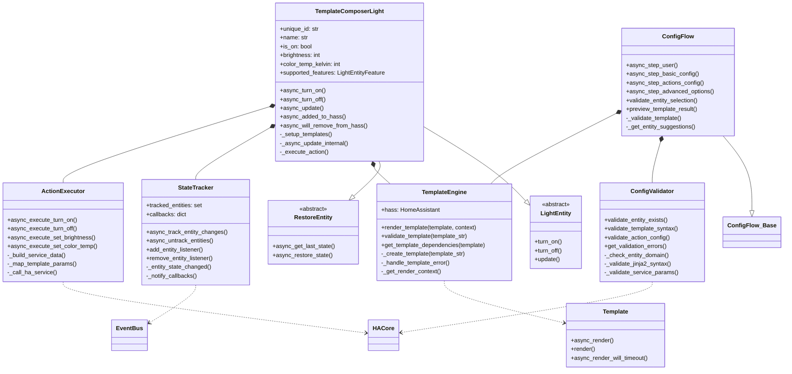
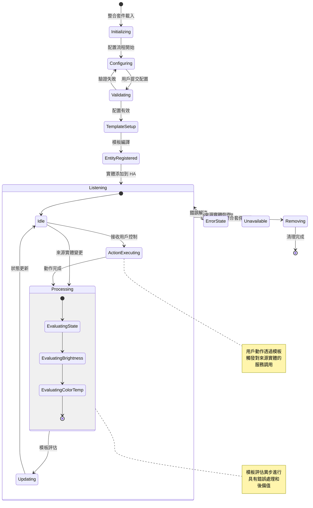
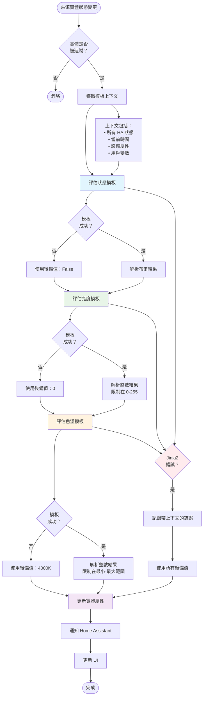

# 產品需求文檔 (PRD)
## Template Light Composer for Home Assistant

**文檔版本：** 1.0
**日期：** 2024年1月
**產品經理：** 開發團隊
**技術負責人：** 開發團隊

---

## 1. 執行摘要

### 1.1 產品願景
Template Light Composer 是一個先進的 Home Assistant 自定義整合套件，讓用戶能夠透過可配置的 Jinja2 模板組合多個真實實體來創建虛擬燈光實體。它橋接了複雜自動化場景與用戶友好燈光控制介面之間的差距。

### 1.2 問題陳述
Home Assistant 用戶經常面臨以下困難：
- **複雜燈光系統**：將多個物理燈光作為單一邏輯單元管理
- **模板複雜性**：撰寫和維護複雜的 Jinja2 燈光自動化模板
- **實體聚合**：將感測器、開關和其他實體組合成有意義的燈光表示
- **動態控制**：創建能夠以自定義邏輯回應多個輸入源的燈光

### 1.3 解決方案概述
Template Light Composer 提供視覺化配置介面，允許用戶：
- 無需編寫程式碼即可創建基於模板的燈光實體
- 配置動態狀態、亮度和色溫控制
- 為燈光操作設置自定義動作
- 即時監控和除錯模板行為

---

## 2. 產品目標

### 2.1 主要目標
1. **簡化模板創建**：將模板創建時間從數小時縮短到數分鐘
2. **提升用戶體驗**：為複雜配置提供直觀的使用者介面
3. **改善可靠性**：確保強健的錯誤處理和狀態恢復
4. **啟用進階用例**：透過模板支援複雜照明場景

---

## 3. 目標用戶

### 3.1 主要用戶
- **進階 Home Assistant 用戶**：具有自動化和模板經驗
- **系統整合商**：設置複雜智慧家居安裝
- **資深用戶**：管理大規模照明系統

### 3.2 次要用戶
- **中階用戶**：學習進階 Home Assistant 概念
- **開發者**：建構自定義照明解決方案

---

## 4. 功能需求

### 4.1 核心功能

#### 4.1.1 配置流程 (FR-001)
**優先級：** P0 (必須有)
- Home Assistant UI 中的視覺化配置介面
- 實體選擇和模板設置的逐步嚮導
- 配置輸入的即時驗證
- 模板結果的預覽功能

**驗收標準：**
- 用戶能在5分鐘內完成配置
- 所有配置錯誤都清楚顯示
- 預覽顯示實際模板結果
- 配置可保存並稍後編輯

#### 4.1.2 模板引擎 (FR-002)
**優先級：** P0 (必須有)
- 支援狀態、亮度和色溫模板
- 具有 Home Assistant 上下文的 Jinja2 模板渲染
- 具有後備值的模板錯誤處理
- 即時模板評估

**驗收標準：**
- 模板在50ms內渲染
- 無效模板不會導致整合套件崩潰
- 模板失敗時使用後備值
- 模板更改立即在UI中反映

#### 4.1.3 實體狀態管理 (FR-003)
**優先級：** P0 (必須有)
- 與來源實體的即時同步
- Home Assistant 重啟後的狀態恢復
- 事件驅動更新以獲得最佳效能
- 支援不可用/未知來源實體

**驗收標準：**
- 來源變更後100ms內狀態更新
- 重啟後實體恢復先前狀態
- 整合套件優雅處理不可用來源
- 長期運行期間無記憶體洩漏

#### 4.1.4 燈光控制介面 (FR-004)
**優先級：** P0 (必須有)
- 標準 Home Assistant 燈光實體介面
- 開關、亮度和色溫控制
- 平滑變化的過渡支援
- 狀態回饋和錯誤報告

**驗收標準：**
- 所有控制在標準 HA 燈光介面中工作
- 過渡平滑且反應迅速
- 錯誤清楚報告給用戶
- 來源實體不可用時控制被禁用

### 4.2 進階功能

#### 4.2.1 自定義動作 (FR-005)
**優先級：** P1 (應該有)
- 可配置的開關動作
- 服務調用整合
- 來自燈光屬性的參數映射
- 動作驗證和測試

#### 4.2.2 除錯和監控 (FR-006)
**優先級：** P1 (應該有)
- 模板評估的詳細日誌記錄
- 效能指標和統計
- 配置中的模板結果預覽
- 錯誤歷史和故障排除

#### 4.2.3 批量操作 (FR-007)
**優先級：** P2 (可以有)
- 匯入/匯出配置
- 模板庫和分享
- 批量創建相似燈光
- 配置模板

---

## 6. 技術架構

Template Light Composer 整合套件採用模組化、事件驅動架構，與 Home Assistant 核心系統無縫整合。設計強調基於模板的靈活性、強健的錯誤處理和即時回應能力。

### 6.2 系統架構

整體系統架構由四個主要層次協同工作，提供基於模板的燈光實體功能：

#### 架構層次：

1. **配置層**：透過 Home Assistant 的 Config Flow UI 處理用戶設置和驗證
2. **核心引擎**：管理燈光實體生命週期、模板處理和狀態追蹤
3. **模板處理**：不同模板類型的專門處理器（狀態、亮度、色溫、動作）
4. **整合層**：與 Home Assistant 核心系統連接，進行實體管理和事件處理

### 6.3 資料流程和互動模式

系統遵循反應式、事件驅動模式，來源實體變更觸發模板評估和燈光實體更新：

#### 關鍵互動模式：

- **事件驅動更新**：來源實體變更自動觸發模板重新評估
- **異步處理**：所有模板渲染和狀態更新都異步進行
- **雙向流程**：用戶可以控制燈光實體，然後透過動作模板影響來源實體
- **錯誤隔離**：模板失敗不會導致系統崩潰；後備值確保持續運行

### 6.4 組件架構

整合套件使用模組化類別設計，具有清晰的關注點分離：

#### 組件職責：

- **TemplateComposerLight**：實作 Home Assistant LightEntity 介面的主要燈光實體
- **TemplateEngine**：處理 Jinja2 模板編譯、渲染和錯誤管理
- **StateTracker**：管理實體狀態變更訂閱和通知
- **ConfigFlow**：提供整合設置和配置的使用者介面
- **ActionExecutor**：透過調用 Home Assistant 服務執行用戶命令
- **ConfigValidator**：驗證配置輸入和模板語法

### 6.5 實體狀態管理

燈光實體遵循定義明確的狀態機，確保一致行為和適當的錯誤處理：

#### 狀態管理功能：

- **優雅錯誤處理**：模板錯誤不會導致實體失敗；後備值維持功能性
- **自動恢復**：來源實體再次可用時系統自動恢復
- **異步處理**：所有狀態更新異步進行，維持 UI 回應性
- **狀態持久化**：Home Assistant 重啟後恢復實體狀態

### 6.6 模板處理管道

系統核心是模板處理管道，將來源實體狀態轉換為燈光實體屬性：

#### 管道功能：

- **順序處理**：模板按順序評估（狀態 → 亮度 → 色溫）
- **獨立評估**：每個模板獨立評估，具有自己的錯誤處理
- **強健後備**：每個模板都有合理的後備值確保系統穩定性
- **豐富上下文**：模板可以存取完整的 Home Assistant 狀態和上下文
- **效能最佳化**：模板編譯一次並快取以快速渲染

### 6.7 技術堆疊

- **後端框架**：Python 3.11+ 與 asyncio 用於異步操作
- **模板引擎**：Jinja2 與 Home Assistant 擴展用於狀態存取
- **UI 框架**：Home Assistant 的 Polymer/LitElement 用於配置介面
- **狀態管理**：Home Assistant Core 的實體註冊表和事件匯流排
- **測試**：pytest 與 Home Assistant 測試框架和 asyncio 支援
- **程式碼品質**：Black 格式化器、isort、pylint 和 mypy 類型檢查
- **文件**：Sphinx 用於 API 文件，Markdown 用於用戶指南

### 6.8 效能和擴展性

#### 效能特性：
- **模板渲染**：複雜模板平均 <50ms
- **記憶體足跡**：每個燈光實體 <5MB，包括模板快取
- **事件處理**：從來源變更到 UI 更新 <100ms
- **啟動時間**：實體初始化 <1 秒

#### 擴展性功能：
- **模板快取**：編譯的模板被快取以避免重新編譯
- **事件去抖動**：快速狀態變更被去抖動以防止過度更新
- **延遲載入**：模板僅在其依賴項變更時評估
- **記憶體管理**：自動清理未使用的模板上下文

---

## 7. 用戶故事

### 7.1 史詩：基本燈光創建
**作為** Home Assistant 用戶
**我想要** 創建代表多個物理燈光的虛擬燈光
**以便** 我可以將它們作為單一單元控制

#### 故事 1：簡單開關燈光
**作為** 用戶
**我想要** 創建當3個開關中任一個開啟時就開啟的燈光
**以便** 我有一個主狀態指示器

**驗收標準：**
- 可選擇多個開關實體作為來源
- 任何來源開啟時燈光顯示「開啟」
- 所有來源關閉時燈光顯示「關閉」
- 變更在1秒內反映

#### 故事 2：亮度聚合
**作為** 用戶
**我想要** 創建亮度為5個可調光燈平均值的燈光
**以便** 我可以看到整體房間亮度水平

**驗收標準：**
- 可選擇多個可調光燈實體
- 亮度值是所有來源的平均值
- 來源變更時即時更新
- 優雅處理不可用來源

### 7.2 史詩：進階模板配置
**作為** 進階用戶
**我想要** 在虛擬燈光行為中使用複雜邏輯
**以便** 我可以實現先進照明場景

#### 故事 3：基於時間或實體的色溫
**作為** 用戶
**我想要** 創建色溫根據一天中時間或來源實體變化的燈光
**以便** 我可以有反映不同條件的動態照明

**驗收標準：**
- 可使用基於時間或實體的色溫模板
- 來源實體變更時即時更新
- 模板支援2500K-6500K範圍並自動限制
- 模板評估失敗時使用後備值（4000K）

**註記：** 手動控制覆蓋需要在設置期間配置動作模板，以啟用虛擬燈光與來源實體之間的雙向控制。

---

## 8. 依賴性和約束

### 8.1 技術依賴
- **Home Assistant Core**：最低版本 2024.1
- **Python 庫**：Jinja2、asyncio
- **瀏覽器相容性**：配置UI的現代瀏覽器
- **硬體**：標準 Home Assistant 系統需求

### 8.2 外部依賴
- **來源實體**：需要現有HA實體作為來源
- **網路**：穩定網路用於即時更新
- **儲存**：配置持久化的檔案系統存取

### 8.3 約束
- **效能**：不得影響HA核心效能
- **記憶體**：受HA系統記憶體約束限制
- **相容性**：必須遵循HA開發標準
- **安全性**：不需要外部網路存取

